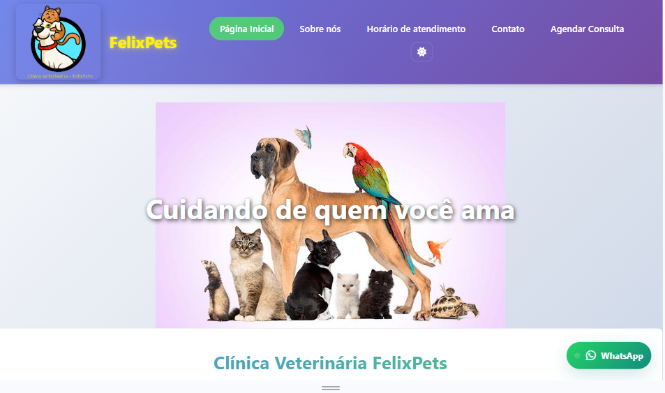

<p align="center">
  <a href="https://developer.mozilla.org/docs/Web/HTML" target="_blank" rel="noopener">
    
  </a>
</p>

<p align="center">
  <a></a>
  <a></a>
  <a></a>
  <a></a>
</p>

## 🐾 Clínica Veterinária - Site Institucional

Um site simples e responsivo para uma clínica veterinária, criado como exercício da Trilha HTML. Ele contém páginas principais, formulário de contato, horário de atendimento e agendamento.

## ✨ Tecnologias

- [HTML5](https://developer.mozilla.org/pt-BR/docs/Web/HTML)
- [CSS3](https://developer.mozilla.org/pt-BR/docs/Web/CSS)
- [JavaScript](https://developer.mozilla.org/pt-BR/docs/Web/JavaScript)

---

## 📋 Sobre o Projeto

- Projeto exemplo para a disciplina/trilha de HTML.
- Estrutura com páginas principais: `index.html`, `sobre-nos1.html`, `horario-atendimento.html`, `contato.html`, `agendamento.html`.
- Layout leve, com foco em estrutura semântica, formulários e elementos de mídia.

---

## 📝 Funcionalidades

- Menu de navegação entre páginas
- Página Inicial com apresentação da clínica
- Página Sobre com informações institucionais
- Horário de Atendimento com tabela de horários
- Página de Contato com formulário (nome, e-mail, assunto, mensagem) e iframe de localização
- Página de Agendamento
- Layout responsivo básico com CSS

---

## 🗂️ Estrutura do Projeto

```
Clinica-Veterinaria/
├── index.html                 # Página principal
├── agendamento.html           # Formulário de agendamento
├── contato.html               # Página de contato com formulário e mapa
├── horario-atendimento.html   # Tabela de horários
├── sobre-nos1.html            # Página sobre a clínica
├── base.css                   # Estilos principais
├── sobre.css                  # Estilos da página Sobre
├── script.js                  # JS do projeto
├── image/                     # Imagens e assets
│   ├── logo.png
│   ├── bichos.jpg
│   └── emergencia.gif
├── README.md                  # Documentação
└── LICENSE                    # Licença
```

---

## ⚙️ Como executar

### Pré-requisitos

- Um navegador moderno (Chrome, Firefox, Edge, Safari)
- (Opcional) servidor local para facilitar rotas e atualizações (extensão Live Server no VS Code)

### Executando localmente

1. Clone o repositório:

```
git clone https://github.com/joserenatofelix/Clinica-Veterinaria.git
```

2. Abra a pasta e abra `index.html` no navegador.

Opções:
- Abrir o arquivo diretamente no navegador.
- Usar Live Server (VS Code) para servir em http://127.0.0.1:5500

---

## 🤝 Contribuindo

Contribuições são bem-vindas! Para contribuir:

1. Faça um fork do projeto
2. Crie uma branch para sua feature: `git checkout -b feature/minha-feature`
3. Faça commits claros: `git commit -m "feat: descrição da mudança"`
4. Envie para sua branch: `git push origin feature/minha-feature`
5. Abra um Pull Request

---

## 📄 Licença

Este projeto está sob a licença MIT — veja o arquivo `LICENSE` para detalhes.

---

## 👨‍💻 Autor

**Renato Felix**

---

## 🎉 Agradecimentos

- Material da Trilha HTML
- Imagens do repositório

---

Se gostou, deixe uma estrela ⭐

Desenvolvido com ❤️ por Renato Felix


